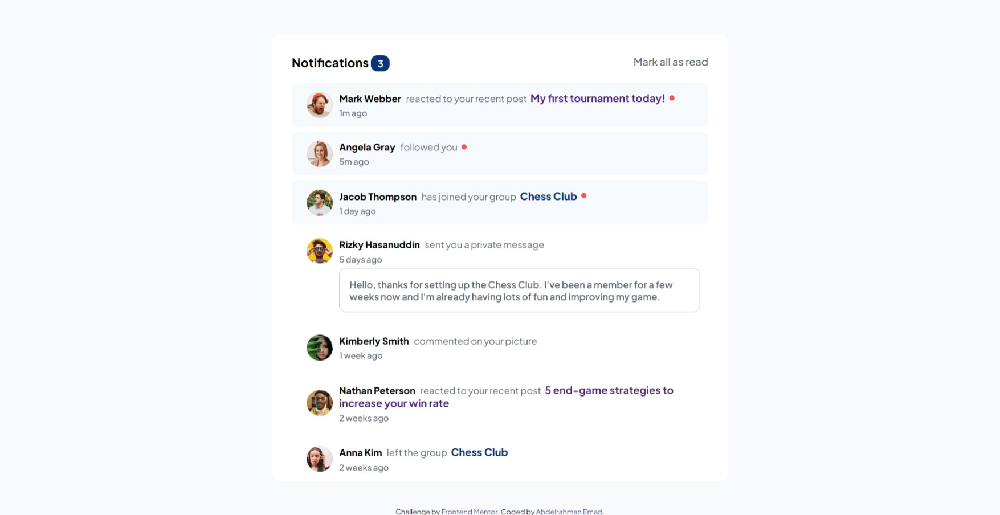
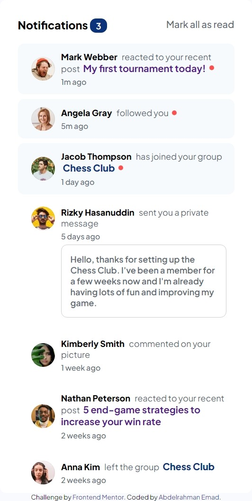

# Frontend Mentor - Notifications page solution

This is a solution to the [Notifications page challenge on Frontend Mentor](https://www.frontendmentor.io/challenges/notifications-page-DqK5QAmKbC).

## Table of contents

- [Overview](#overview)
  - [The challenge](#the-challenge)
  - [Screenshot](#screenshot)
  - [Links](#links)
- [My process](#my-process)
  - [Built with](#built-with)
  - [What I learned](#what-i-learned)
  - [Continued development](#continued-development)
  - [Useful resources](#useful-resources)
- [Author](#author)

## Overview

### The challenge

I should be able to:

- Distinguish between "unread" and "read" notifications
- Select "Mark all as read" to toggle the visual state of the unread notifications and set the number of unread messages to zero
- View the optimal layout for the interface depending on their device's screen size
- See hover and focus states for all interactive elements on the page

### Screenshot

### Links

- Solution URL: [Add solution URL here](https://your-solution-url.com)
- Live Site URL: [Add live site URL here](https://your-live-site-url.com)

## My process

### Built with

- Semantic HTML5 markup
- CSS custom properties
- Flexbox
- Mobile-first workflow
- javaScript

### What I learned

I have learned more about semantic html and how to organize it, I also practice more on the javascript code applications

### Useful resources

- [MDN](https://developer.mozilla.org/en-US/)
- [W3SCHOOL](https://www.w3schools.com/)
- [Freecodecamp](https://www.freecodecamp.org/)

## Author

- LinkedIn - [Abdelrahman Emad](https://www.linkedin.com/in/abdelrahman-emad-57bb10237/)
- Frontend Mentor - [@3omeed](https://www.frontendmentor.io/profile/3omeed)
